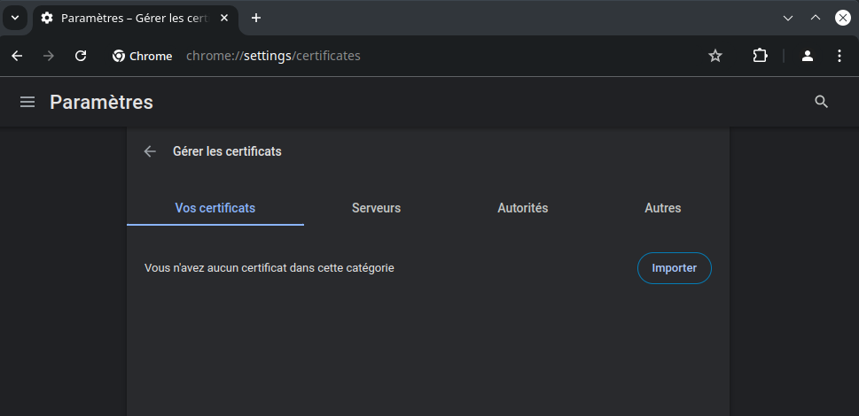
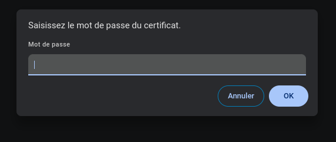
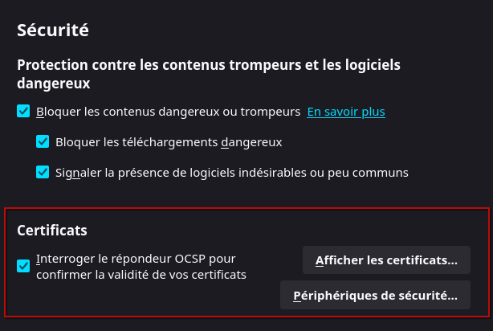

# Step 1 - Obtenir un certificat d'authentification du PKI

## Création de signature du certificat

L'accès au système de demandes de certificats se fait en utilisant un certificat d'authentification.

Afin de générer ce certificat vous aurez besoin de générér un CSR (Demande de signature de certificats - Certificate Signing Request), pour ceci je vous recommande l'utilisation de OpenSSL.

Génération de la CSR et des clés privées:

```bash
openssl req -newkey ec:<(openssl genpkey -genparam -algorithm ec -pkeyopt ec_paramgen_curve:P-256) -keyout orion-pki.key -out orion-pki.csr
```

> Un mot de passe vous sera demandé pour la création du fichier `.key`, pensez a mettre un mot de passe sécurisé dans le cas ou votre clé privée se ferait voler.

Cette commande créera deux fichiers nommés
- `orion-pki.key` qui est votre clé privée
- `orion-pki.csr` qui est votre demande de signature de certificat

La prochaine étape est d'envoyer votre CSR à [Matthieu](mailto:matthieu+orioncsr@mpgn.dev), qui est l'administrateur du pki Orion au temps de l'écriture de ce guide;

Ce dernier vous posera quelques questions concernant votre lien avec le projet Orion, et si tout se passe bien vous enverra un fichier `orion-pki.pem`, qui sera votre fichier de certificat.

Désormais, le fichier `orion-pki.csr` peut être supprimé.

La prochaine étape est de convertir nos deux fichiers en un seul fichier `orion-pki.p12` contenant le certificat et la clé privée.

Encore une fois, OpenSSL est adéquat afin de convertir les certificats.

```bash
openssl pkcs12 -export -in orion-pki.pem -inkey orion.key -out orion-pki.p12
```

> Le mot de passe de `orion-pki.key` vous sera demandé, ainsi qu'un mot de passe pour chiffrer le fichier `.p12`

## Ajout du certificat aux navigateurs

### Chrome

> Ce guide est aussi valable pour les variantes de Chrome tel que Chromium

Render vous dans [chrome://settings/certificates](chrome://settings/certificates)



Puis sélectionnez le boutton "Importer" et sélectionnez votre fichier `orion-pki.p12`


Pour finir, Chrome vous demandera le mot de passe du fichier `orion-pki.p12` crée précédemment



### Firefox

Se rendre dans [about:preferences#privacy](about:preferences#privacy) et trouver la partie "Sécurité > Certificats"



Et sélectionner "Afficher les certificats..." 


Puis sélectionner "Importer..." dans l'onglet "Vos certificats" et sélectionner le fichier `.p12` crée durant la première partie.


Par la suite, Firefox vous demandera le mot de passe donné au fichier `.p12` en première partie


# Fin

Dès que ce dernier est importé, vous pouvez vous connecter à [https://pki.orionet.re](https://pki.orionet.re) pour continuer le guide.
