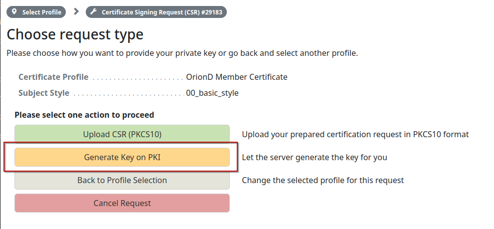

# Step 2 - Obtenir un certificat d'authentification pour OrionD

En visitant le [PKI](https://pki.orionet.re/) vous aurez le choix de pouvoir s'authentifier avec le certificat généré durant la partie 1.

Puis sélectionnez "Client Certificate" comme méthode d'authentification:

Vous pouvez ensuite aller dans l'onglet `Request Certificate`:

Et sélectionnez `OrionD Member Certificate`:

Puis choisir l'option "Generate Key on PKI":

Vous devez spécifier votre numéro de membre Orion:

Des informations supplémentaires vous seront demandées (attention: Ces informations sont succeptibles d'être publiées sur la dashboard de Orion dans le futur):

Par la suite, envoyez la demande de certificat:

Par la suite, un mot de passe sera généré, ce qui sera utilisé pour récupérer la clé privée dans les prochaines étapes:

A présent vous devez prévenir un administrateur du réseau Orion afin d'attester la signature de votre certificat
Quand c'est fait, vous serez sur cet écran:

Vous pourrez ensuite télécharger la clé privée du certificat:

Pensez bien a mettre les certificats ci dessous pour le téléchargement:

Vous pouvez ensuite télécharger le "bundle" contenant la chaîne de certificats:

## Fin

Vous avez désormais des certificats valables pour l'installation et le fonctionnement de OrionD