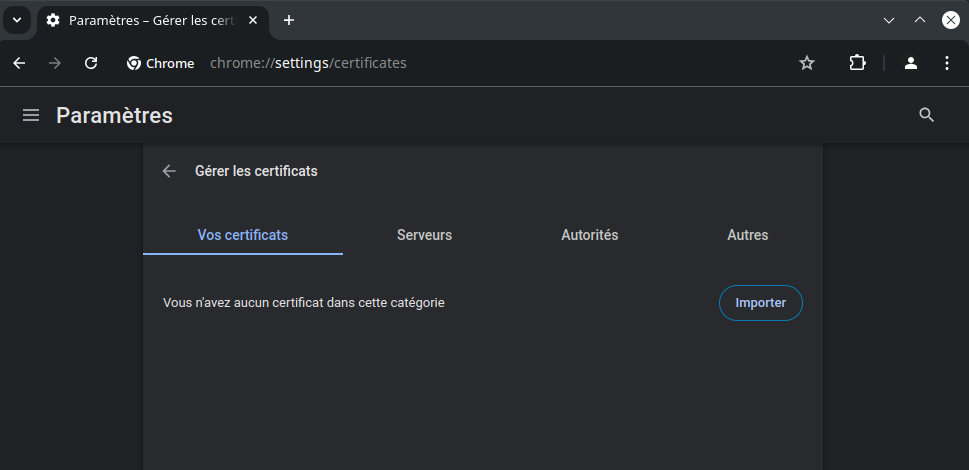
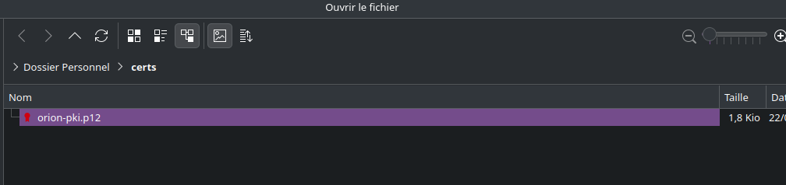
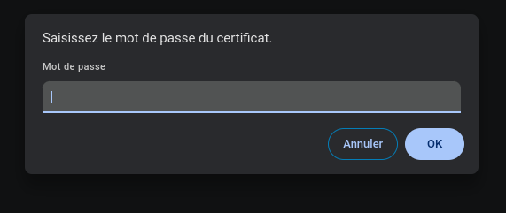
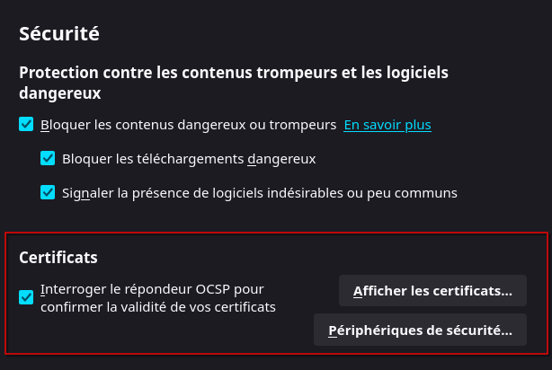
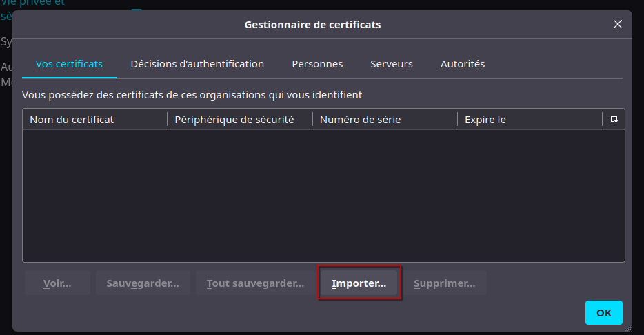
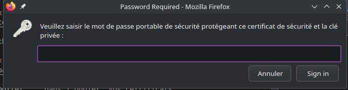

# Accès au système de demande de certificats

## Création de signature du certificat

L'accès au système de demandes de certificats se fait en utilisant un certificat d'authentification.

Afin de générer ce certificat vous aurez besoin de générér u CSR (Demande de signature de certificats - Certificate Signling Request), pour ceci je vous recommande l'utilisation de OpenSSL.

Génération de la CSR et des clés privées:

```bash
openssl req -newkey ec:<(openssl genpkey -genparam -algorithm ec -pkeyopt ec_paramgen_curve:P-256) -keyout orion-pki.key -out orion-pki.csr
```

> Un mot de passe vous sera demandé pour la création du fichier `.key`, pensez a mettre un mot de passe sécurisé dans le cas ou votre clé privée se ferait voler.

Cette commande créera deux fichiers nommés
- `orion-pki.key` qui est votre clé privée
- `orion-pki.csr` qui est votre demande de signature de certificat

La prochaine étape est d'envoyer votre CSR à [Matthieu](mailto:matthieu+orioncsr@mpgn.dev), qui est l'administrateur du pki orion au temps de l'écriture de ce guide;

Ce dernier vous posera quelques questions concernant votre lien avec le projet orion, et si tout se passe bien vous enverra un fichier `orion-pki.pem`, qui sera votre fichier de certificat.

Désormais, le fichier `orion-pki.csr` peut être supprimé.

La prochaine étape est de convertir nos deux fichiers en un seul fichier `orion-pki.p12` contenant le certificat et la clé privée.

Encore une fois, OpenSSL est adéquat afin de convertir les certificats.

```bash
openssl pkcs12 -export -in orion-pki.pem -inkey orion.key -out orion-pki.p12
```

> Le mot de passe de `orion-pki.key` vous sera demandé, ainsi qu'un mot de passe pour chiffrer le fichier `.p12`

## Ajout du certificat aux navigateurs

### Chrome

> Ce guide est aussi valable pour les variantes de Chrome tel que Chromium

Render vous dans [chrome://settings/certificates](chrome://settings/certificates)



Puis sélectionnez le boutton "Importer" et sélectionnez votre fichier `orion-pki.p12`



Pour finir, Chrome vous demandera le mot de passe du fichier `orion-pki.p12` crée précédemment



### Firefox

Se rendre dans [about:preferences#privacy](about:preferences#privacy) et trouver la partie "Sécurité > Certificats"



Et sélectionner "Afficher les certificats..." 



Puis sélectionner "Importer..." dans l'onglet "Vos certificats" et sélectionner le fichier `.p12` crée durant la première partie.


Par la suite, Firefox vous demandera le mot de passe donné au fichier `.p12` en première partie




# Fin

Dès que ce dernier est importé, vous pouvez vous connecter à [https://pki.orionet.re](https://pki.orionet.re) pour continuer le guide.
